## Exercise 03: Interface & Recap

### Subject Overview

Exercise 03 in the C++ module focuses on implementing interfaces using pure abstract classes to simulate a game scenario involving characters and materials. The primary objective is to demonstrate an understanding of interfaces, polymorphism, and dynamic dispatch in C++.

### Detailed Explanation of Subject Requirements

```mermaid
graph TD;
    Start[Start] --> Define_AMateria_Class[Define AMateria Class];
    Define_AMateria_Class --> Define_Ice_and_Cure_Classes[Define Ice and Cure Classes];
    Define_Ice_and_Cure_Classes --> Define_ICharacter_Interface[Define ICharacter Interface];
    Define_ICharacter_Interface --> Implement_Character_Class[Implement Character Class];
    Implement_Character_Class --> Define_IMateriaSource_Interface[Define IMateriaSource Interface];
    Define_IMateriaSource_Interface --> Implement_MateriaSource_Class[Implement MateriaSource Class];
    Implement_MateriaSource_Class --> Implement_Floor_Class[Implement Floor Class];
    Implement_Floor_Class --> Test_Implemented_Classes[Test Implemented Classes];
    Test_Implemented_Classes --> End[End];

    Define_AMateria_Class -- "AMateria Class: Represents a material used by characters. Includes type and isTaken flag." --> Define_Ice_and_Cure_Classes;
    Define_Ice_and_Cure_Classes -- "Ice and Cure Classes: Derive from AMateria. Represent different types of materials (ice and cure)." --> Define_ICharacter_Interface;
    Define_ICharacter_Interface -- "ICharacter Interface: Represents a character in the game. Declares methods for equipping, unequipping, and using materials." --> Implement_Character_Class;
    Implement_Character_Class -- "Character Class: Implements ICharacter Interface. Represents a character with a name and an inventory of materials." --> Define_IMateriaSource_Interface;
    Define_IMateriaSource_Interface -- "IMateriaSource Interface: Represents a source of materials. Declares methods for learning and creating materials." --> Implement_MateriaSource_Class;
    Implement_MateriaSource_Class -- "MateriaSource Class: Implements IMateriaSource Interface. Acts as a source of materials and manages a repository of learned materials." --> Implement_Floor_Class;
    Implement_Floor_Class -- "Floor Class: Singleton class that manages dropped materials in the game." --> Test_Implemented_Classes;
    Test_Implemented_Classes -- "Tests: Perform tests to ensure correct implementation and functionality of all classes." --> End;
```

1. **AMateria Class**: You are required to complete the definition of the `AMateria` class. This class serves as an abstract base class representing a material used by characters in the game. It should have the following features:
   - A protected member variable `type` to store the type of the material.
   - A constructor that initializes the `type`.
   - A pure virtual function `clone()` that should be overridden by derived classes to create a clone of the material.
   - A pure virtual function `use(ICharacter& target)` that should be overridden by derived classes to define the specific action of the material.

2. **Ice and Cure Classes**: Implement concrete classes `Ice` and `Cure` derived from `AMateria`. These classes represent different types of materials (ice and cure) and should provide implementations for the `clone()` and `use()` functions.

3. **ICharacter Interface**: Define an interface `ICharacter` representing a character in the game. This interface should include the following pure virtual functions:
   - `getName()`: Returns the name of the character.
   - `equip(AMateria* m)`: Equips a material to the character's inventory.
   - `unequip(int idx)`: Unequips a material from the character's inventory.
   - `use(int idx, ICharacter& target)`: Uses a material from the character's inventory on a target character.

4. **Character Class**: Implement a concrete class `Character` that represents a character in the game. This class should implement the `ICharacter` interface and provide functionalities to manage the character's inventory of materials. Deep copy of all classes is expected, pay extra attention to this one, test deep copy of an Character class, this is asked in evaluation.

5. **IMateriaSource Interface**: Define an interface `IMateriaSource` representing a source of materials. This interface should include the following pure virtual functions:
   - `learnMateria(AMateria* m)`: Learns a material and stores it in memory.
   - `createMateria(std::string const & type)`: Creates a new material of the specified type.

6. **MateriaSource Class**: Implement a concrete class `MateriaSource` that represents a source of materials. This class should implement the `IMateriaSource` interface and provide functionalities to learn and create materials.

### Additional Considerations

- Ensure proper memory management to avoid memory leaks.
- Test various scenarios to validate the functionality and correctness of the implemented classes and interfaces.

In Exercise 03, it's essential to understand the memory management requirements when dealing with Materias. Here's a detailed explanation:

1. **Dynamic Memory Allocation (New)**:
   - When creating instances of Materias (such as `Ice` and `Cure`), dynamic memory allocation using the `new` keyword is necessary. This ensures that Materias are allocated on the heap, allowing them to persist beyond the scope of their creation.
   - For example, when a Materia is learned by a MateriaSource or equipped by a Character, it should be allocated dynamically to ensure its lifetime is managed properly.

2. **Unequip Functionality**:
   - The `unequip()` function in the `Character` class should not delete the Materias it removes from the inventory. Instead, you should keep track of the Materias for later deletion. (Requested in subject)

3. **Memory Deallocation**:
   - Memory allocated for Materias should be properly deallocated to avoid memory leaks.
   - The destructor of the `Character` class should iterate through its inventory and delete each Materia it contains.
   - Similarly, the destructor of the `MateriaSource` class should delete all the Materias it has learned when the MateriaSource object is destroyed.

My solution for the requirement of not deleting Materias immediately upon unequipping them involves the use of a singleton class called `Floor`. Here's how your solution works:

1. **Floor Class**:
   - The `Floor` class is implemented as a singleton, meaning that only one instance of this class can exist throughout the program's execution.
   - It manages the dropped Materias that are no longer equipped by any character. This ensures that Materias are not lost and can be deleted later without causing memory leaks.
   - The `Floor` class stores a collection of dropped Materias, keeping track of them until they are properly deleted.

2. **Singleton Pattern**:
   - By implementing the `Floor` class as a singleton, you ensure that there is only one instance of `Floor` accessible globally.
   - This singleton instance is accessible from anywhere in the program, allowing any part of the code to drop Materias onto the `Floor` for safekeeping.

3. **Dropping Materias**:
   - When a Materia is unequipped by a Character, it is not immediately deleted. Instead, it is dropped onto the `Floor` using the `dropMateria()` function.
   - This function adds the Materia to the collection of dropped Materias maintained by the `Floor` singleton.

4. **Later Deletion**:
   - The `Floor` singleton keeps track of all dropped Materias until they are explicitly deleted.
   - During program shutdown (Floor destructor) or at any appropriate time, the `cleanFloor()` function can be called to delete all the dropped Materias from the `Floor`.
   - By delaying the deletion of dropped Materias until this cleanup step, you ensure that memory is managed efficiently and no memory leaks occur.

Feel free to reach out if you have any questions or need further clarification. Happy coding
